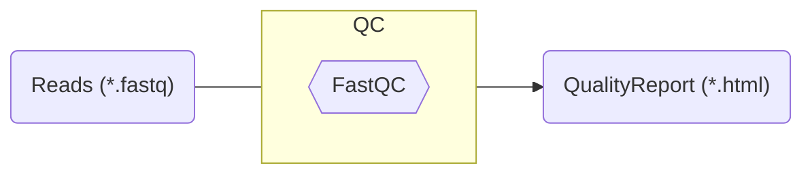

# Example tool: FastQC

First step in RNASeq data analysis: QC of read files (e.g. *.fastq)

```mermaid
flowchart LR
  f1("Reads (*.fastq)") ---p1[QC]--> f3("QualityReport (*.html)")
  subgraph p1[QC]
      p1-1{{FastQC}}
  end
```

---