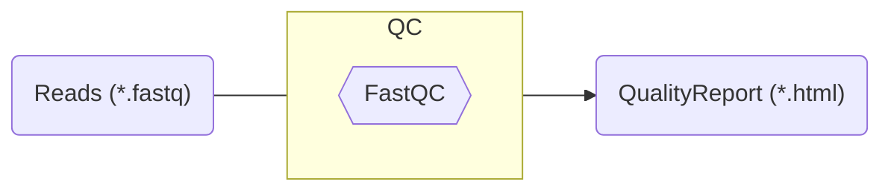

# FastQC via command line

::left::

```bash
fastqc --version
fastqc --help
```

::right::

`fastqc assays/rnaseq/dataset/sample1.fastq.gz`


```mermaid
flowchart LR
  f1("Reads (*.fastq)") ---p1[QC]--> f3("QualityReport (*.html)")
  subgraph p1[QC]
      p1-1{{FastQC}}
  end
```
