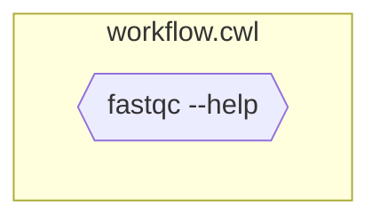

# Step 1: Define CLI tool as CWL CommandLineTool

::left::

- Without in/out
- (Requires **local tool installed**)


```yaml [workflow.cwl]
#!/usr/bin/env cwl-runner
cwlVersion: v1.2
class: CommandLineTool

baseCommand: ["fastqc", "--help"]

inputs: []
 
outputs: []
```

::right::




