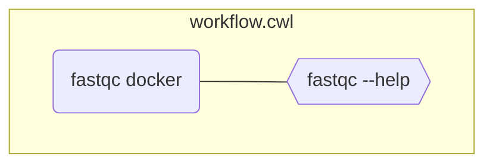

# Step 2: Add a docker container

::left::

```yaml [workflow.cwl] {5-7}
#!/usr/bin/env cwl-runner
cwlVersion: v1.2
class: CommandLineTool

hints:
  DockerRequirement:
    dockerPull: quay.io/biocontainers/fastqc:0.11.9--hdfd78af_1

baseCommand: ["fastqc", "--help"]

inputs: []
 
outputs: []
```

::right::

<div class="scale-60 origin-top">



</div>
