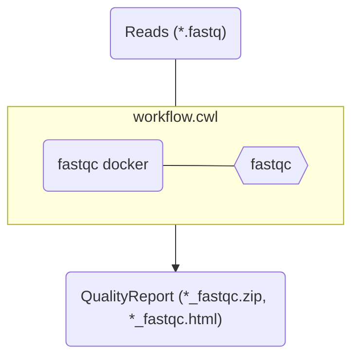

# Step 4: Define outputs

::left::

```yaml [workflow.cwl] {21-27}{maxHeight:'70%'}
#!/usr/bin/env cwl-runner
cwlVersion: v1.2
class: CommandLineTool

hints:
  DockerRequirement:
    dockerPull: quay.io/biocontainers/fastqc:0.11.9--hdfd78af_1

baseCommand: ["fastqc"]

inputs:
  reads:
    type: File[]
    inputBinding:
      position: 1

arguments: 
  - valueFrom: $(runtime.outdir)
    prefix: "-o"

outputs:
  fastqc_out:
      type: File[]
      outputBinding:
        glob:
          - "*_fastqc.zip"
          - "*_fastqc.html"
```

::right::

<div class="scale-75 origin-top">




</div>


