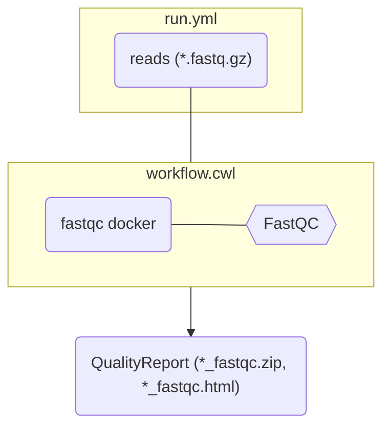

# Run the workflow

You can provide arguments via another file:

::left::

```yaml [run.yml]
reads:
  - class: File
    path: ../../assays/rnaseq/dataset/blau1_CGATGT_L005_R1_002.fastq.gz
  - class: File
    path: ../../assays/rnaseq/dataset/blau2_TGACCA_L005_R1_002.fastq.gz
```


::right::

<div class="scale-75 origin-top">



</div>


