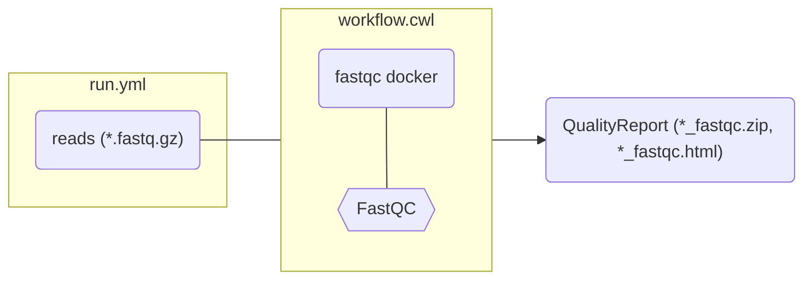

# Run the workflow

You can provide arguments via another file:

::left::

```yaml [run.yml]
reads:
  - class: File
    path: assays/rnaseq/dataset/sample1.fastq.gz
  - class: File
    path: assays/rnaseq/dataset/sample2.fastq.gz
```

```yaml [workflow.cwl] {11-13}
#!/usr/bin/env cwl-runner
cwlVersion: v1.2
class: CommandLineTool

hints:
  DockerRequirement:
    dockerPull: quay.io/biocontainers/fastqc:0.11.9--hdfd78af_1

baseCommand: ["fastqc"]

inputs:
  reads:
    type: File[]
    inputBinding:
      position: 1
...
```

::right::

<div class="scale-85 origin-top">



</div>

<div class="scale-95 origin-right">


```bash
cwltool workflow.cwl run.yml
```

</div>


