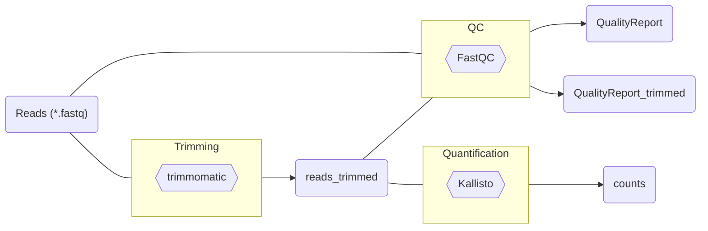

# Growing pipeline: First steps RNASeq pipeline

```mermaid
flowchart LR
  f1("Reads (*.fastq)") ---p1[QC]--> f3(QualityReport)
  f1 ---p2--> f2(reads_trimmed)
  f2(reads_trimmed) ---p1--> f4(QualityReport_trimmed)
  f2(reads_trimmed) ---p3--> f5(counts)
  subgraph p1[QC]
      p1-1{{FastQC}}
  end
  subgraph p2[Trimming]
      p2-1{{trimmomatic}}
  end
  subgraph p3[Quantification]
      p3-1{{Kallisto}}
  end
```

---